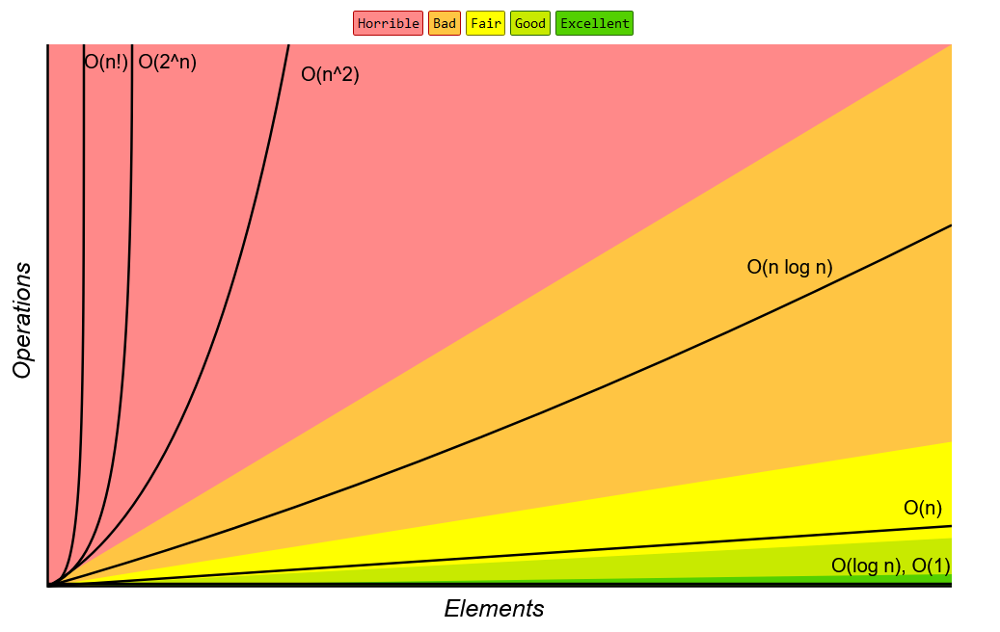

# Practice with Java 

A repository for algorithms and data structures in Java. I've created this repo to save solutions to questions I've found challenging and important for applying for a junior Java-dev role. I comment on some of the lines for my own understanding, but maybe someone can also find these solutions useful. 

I'm not the full author for most of these solutions, but I try to write and rewrite them as efficient as possible. Most solutions can be compiled right away to check if they work correctly.

This was my first big GitHub-repo, so not only was I learning Java by adding one-two files every day after browsing Leetcode or Codewars, but also learтing Git and its features, so sometimes there's too many commits that could be united in one and comments are not so informative. Still, I use this repo as a way to keep track of my record and preserve motivation to solve tasks in Java daily. 

## Algorithms
* **Arrays**
  * [Swap elements in array](https://github.com/Linkshegelianer/practice-with-java/blob/main/Solutions-to-small-tasks/Swap-elements-in-array.java)
  * [Caltucale sum in array](https://github.com/Linkshegelianer/practice-with-java/blob/main/Solutions-to-small-tasks/Caltucale-sum-in-array.java)
  * [Split array into chunks](https://github.com/Linkshegelianer/practice-with-java/blob/main/Solutions-to-small-tasks/Split-array-into-chunks.java)
  * [Continuous sequence array](https://github.com/Linkshegelianer/practice-with-java/blob/main/Solutions-to-small-tasks/Continuous-sequence-array.java)
  * [Find and replace strings in array](https://github.com/Linkshegelianer/practice-with-java/blob/main/Solutions-to-small-tasks/Find-and-replace-strings-in-array.java)
  * [Get same parity in array](https://github.com/Linkshegelianer/practice-with-java/blob/main/Solutions-to-small-tasks/Get-same-parity-in-array.java)
* **Matrices**
  * [Mirror matrix](https://github.com/Linkshegelianer/practice-with-java/blob/main/Solutions-to-small-tasks/Mirror-matrix.java)
  * [Multiply matrix](https://github.com/Linkshegelianer/practice-with-java/blob/main/Solutions-to-small-tasks/Multiply-matrix.java)
  * [Rotate Matrix](https://github.com/Linkshegelianer/practice-with-java/blob/main/Solutions-to-small-tasks/Rotate-Matrix.java)
* **Common interview questions**
  * [Add digits from int](https://github.com/Linkshegelianer/practice-with-java/blob/main/Solutions-to-small-tasks/Add-digits-from-int.java)
  * [Balanced parens](https://github.com/Linkshegelianer/practice-with-java/blob/main/Solutions-to-small-tasks/Balanced-parens.java)
  * [FizzBuzz](https://github.com/Linkshegelianer/practice-with-java/blob/main/Solutions-to-small-tasks/FizzBuzz.java)
  * [Hamming weight of int](https://github.com/Linkshegelianer/practice-with-java/blob/main/Solutions-to-small-tasks/Hamming-weight-of-int.java)
* **Math**
  * [Fib numbers](https://github.com/Linkshegelianer/practice-with-java/blob/main/Solutions-to-small-tasks/Fib-numbers.java)
  * [Pascal's triangle](https://github.com/Linkshegelianer/practice-with-java/blob/main/Solutions-to-small-tasks/PascalsTriangle.java)
  * [Power of three](https://github.com/Linkshegelianer/practice-with-java/blob/main/Solutions-to-small-tasks/Power-of-three.java)
* **Sorting**
  * [Bubble sort](https://github.com/Linkshegelianer/practice-with-java/blob/main/Solutions-to-small-tasks/Bubble-sort.java)
* **Strings**
  * **Palindrome**

## Data structures
* **Linked List**
* **Stack**
* **Queue**
* **Binary Tree**
* **Binary Search Tree**   
* **Heap**      
* **Hashing**  
* **Graph**    
    
## OOP examples
  * [Circle](https://github.com/Linkshegelianer/practice-with-java/blob/main/OOP-explanations/Circle.java) - example of building a class

## Useful information:

Source: [Big O Cheat Sheet](http://bigocheatsheet.com/).

| Big O Notation | Type        | Computations for 10 elements | Computations for 100 elements | Computations for 1000 elements  |
| -------------- | ----------- | ---------------------------- | ----------------------------- | ------------------------------- |
| **O(1)**       | Constant    | 1                            | 1                             | 1                               |
| **O(log N)**   | Logarithmic | 3                            | 6                             | 9                               |
| **O(N)**       | Linear      | 10                           | 100                           | 1000                            |
| **O(N log N)** | n log(n)    | 30                           | 600                           | 9000                            |
| **O(N^2)**     | Quadratic   | 100                          | 10000                         | 1000000                         |
| **O(2^N)**     | Exponential | 1024                         | 1.26e+29                      | 1.07e+301                       |
| **O(N!)**      | Factorial   | 3628800                      | 9.3e+157                      | 4.02e+2567                      |
+ add **O(N + K)** and **O(NK)**

### Array Sorting Algorithms Complexity

| Algorithm           | Time complexity                                  | Auxiliary data    |
| --------------------| -------------------------------------------------| ------------------| 
|                     | Best           | Average        | Worst          | Worst             |
| **Quick sort**      | **O(N log N)** | **O(N log N)** | **O(N^2)**     | **O(N)**          |
| **Merge sort**      | **O(N log N)** | **O(N log N)** | **O(N log N)** | **O(N)**          |
| **Heapsort**        | **O(N log N)** | **O(N log N)** | **O(N log N)** | **O(1)**          |
| **Bubble sort**     | **O(N)**       | **O(N^2)**     | **O(N^2)**     | **O(1)**          |
| **Insertion sort**  | **O(N)**       | **O(N^2)**     | **O(N^2)**     | **O(1)**          |
| **Selection sort**  | **O(N^2)**     | **O(N^2)**     | **O(N^2)**     | **O(1)**          |
| **Bucket sort**     | **O(N + K)**   | **O(N + K)**   | **O(N^2)**     | **O(NK)**         |
| **Radix sort**      | **O(NK)**      | **O(NK)**      | **O(NK)**      | **O(N + K)**      | 

